# Desafio AWS

## 1 - Setup de ambiente

Após rodar a stack com o arquivo do desafio, executei o describe para conseguir o IP público da EC2:

    ❯ aws cloudformation describe-stacks --region us-east-1 --query "Stacks[?StackName=='"$STACK_NAME"'][].Outputs[?OutputKey=='PublicIp'].OutputValue" --output text --no-cli-pager

    44.201.59.67

## 2 - Networking

Então, ao acessar este IP pelo o navegador, constatei que o mesmo não retornou a resposta web desejada, mas um timeout

Seguindo a dica do desafio, fui ao secutiry group e vi que a regra de entrada estava permitindo um endereço específico numa porta não usual:

Então alterei a regra de entrada para aceitar qualquer requisição do meu IP na porta 80:

E o resultado foi a resposta web desejada:

.
## 3 - EC2 Access

Para cumprir o desafio 3, fui no dashboard de EC2 e cliquei na instância criada pelo o segundo cloudformation:

No painel seguinte, verifiquei o nome público (DNS) da instância e, primeiramente, verifiquei se a mesma resolvia o FQDN público e estava com a porta 22 escutando requisições para meu IP:

    ❯ dig ec2-44-201-59-67.compute-1.amazonaws.com +short
    44.201.59.67

    ❯ telnet ec2-44-201-59-67.compute-1.amazonaws.com 22      
    Trying 44.201.59.67...
    ^C
 Ao perceber que o tráfego não era permitido, acrescentei a conexão ssh ao meu IP nas regras de entrada do security group e a porta ficou disponível:

 

    ❯ telnet ec2-44-201-59-67.compute-1.amazonaws.com 22 
    Trying 44.201.59.67...
    Connected to ec2-44-201-59-67.compute-1.amazonaws.com.
    Escape character is '^]'.
    SSH-2.0-OpenSSH_7.4

Então, ainda na página de EC2, naveguei pelo o menu lateral esquerdo até "pares de chaves" e criei a key-pair "aws-lab-key":

Após baixá-la, extrai a chave publica da mesma e desliguei a instância para que fosse possível editar os dados de usuário e inserir a nova chave

    ❯ ssh-keygen -y -f aws-lab-key.pem                  
    ssh-rsa AAAAB3NzaC1yc2EAAAADAQABAAABAQCQGDdEtLzghrHBJSDJYdxbOlNuweZuHSDUGu5YvtxdAxwW0L6mDVftdh4+AOsNnJzU/UH0H3gtGUDcjq4KHBx0h2svUoJulWcT+Lg85Q7it1zpy6skpKd8M153H58wULnsyupZz44oMd2wp7HpiYG+uG6K1dk9LtO+e4Ge5TnlK/FdzC6I3bZJh59UMqsy+T1mZfYu9VFQzoEa1D4cMMPXeS/JAZy24l9PYgxq3o3Vy8hWyFd3LXb2jghzoMKz3R929K7ilxgKtP5O4j5pgEEy2cogYl3oNfF0rQANaR1eqeP4X/MQtXSdqGLxgKtxi+9ptiBCqXtcJvaw3Nt/pDk9

    Content-Type: multipart/mixed; boundary="//"
    MIME-Version: 1.0

    --//
    Content-Type: text/cloud-config; charset="us-ascii"
    MIME-Version: 1.0
    Content-Transfer-Encoding: 7bit
    Content-Disposition: attachment; filename="cloud-config.txt"

    #cloud-config
    cloud_final_modules:
    - [users-groups, once]
    users:
    - name: ec2-user
        ssh-authorized-keys: 
        - ssh-rsa AAAAB3NzaC1yc2EAAAADAQABAAABAQCQGDdEtLzghrHBJSDJYdxbOlNuweZuHSDUGu5YvtxdAxwW0L6mDVftdh4+AOsNnJzU/UH0H3gtGUDcjq4KHBx0h2svUoJulWcT+Lg85Q7it1zpy6skpKd8M153H58wULnsyupZz44oMd2wp7HpiYG+uG6K1dk9LtO+e4Ge5TnlK/FdzC6I3bZJh59UMqsy+T1mZfYu9VFQzoEa1D4cMMPXeS/JAZy24l9PYgxq3o3Vy8hWyFd3LXb2jghzoMKz3R929K7ilxgKtP5O4j5pgEEy2cogYl3oNfF0rQANaR1eqeP4X/MQtXSdqGLxgKtxi+9ptiBCqXtcJvaw3Nt/pDk9

Assim, foi possível acessar a instância via cliente ssh:

    ❯ ssh -i "aws-lab-key.pem" ec2-user@ec2-34-201-24-186.compute-1.amazonaws.com
    Warning: Permanently added 'ec2-34-201-24-186.compute-1.amazonaws.com,34.201.24.186' (ECDSA) to the list of known hosts.

        __|  __|_  )
        _|  (     /   Amazon Linux 2 AMI
        ___|\___|___|

    https://aws.amazon.com/amazon-linux-2/
    48 package(s) needed for security, out of 91 available
    Run "sudo yum update" to apply all updates.
    [ec2-user@ip-10-0-1-103 ~]$

Então editei o arquivo informado, colocando meu nome no começo da linha e reiniciei o serviço do httpd. A resposta no navegador foi a esperada:

    sudo vim /var/www/html/index.html
    sudo service httpd restart

.

## 4 - EC2 troubleshooting

Primeiramente, habilitei o serviço do httpd dentro da máquina:

    ssh -i "aws-lab-key.pem" ec2-user@ec2-3-235-85-180.compute-1.amazonaws.com                                       
    Warning: Permanently added 'ec2-3-235-85-180.compute-1.amazonaws.com,3.235.85.180' (ECDSA) to the list of known hosts.
    Last login: Tue Sep 27 03:49:52 2022 from 179.83.149.253

        __|  __|_  )
        _|  (     /   Amazon Linux 2 AMI
        ___|\___|___|

    https://aws.amazon.com/amazon-linux-2/
    48 package(s) needed for security, out of 91 available
    Run "sudo yum update" to apply all updates.
    [ec2-user@ip-10-0-1-103 ~]$ sudo systemctl enable httpd
    Created symlink from /etc/systemd/system/multi-user.target.wants/httpd.service to /usr/lib/systemd/system/httpd.service.

Por conta que o bootstrap da instância foi alterado para colocar a chave pública do desafio anterior, foi necessário desligar novamente a instância para alterar o bootstrap nos dados de usuário:

Então os dados abaixo foram colocados para cumprir com o desafio anterior e este:

    #!/bin/bash
    systemctl start httpd

.
## 5 - Balanceamento

Para criar uma cópia da instância, primeiro desliguei-a e fui até o submenu lateral "Volumes". Nesta página selecionei o volume referente a instância e, no submenu actions desse volume, selecionei a opção criar snapshot:

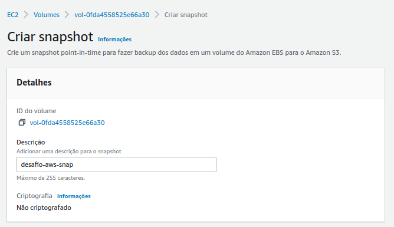

O snaphost foi criado com sucesso e, a partir dele, foi criado uma AMI navegando pelo submenu "actions" na página de snapshot:

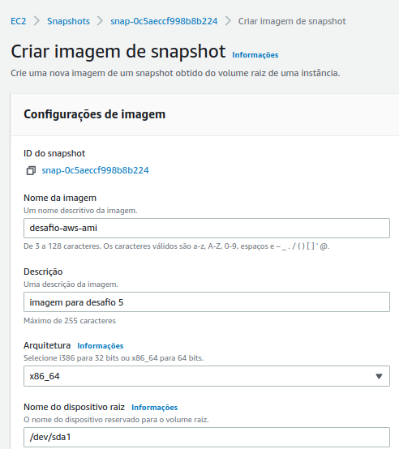

Então uma nova instância foi criada a partir do menu "actions" na página de imagens, mantendo todos campos similares à instância original. OBS: foi necessário editar as configurações de rede para apontar para as mesmas configurações da ec2 original

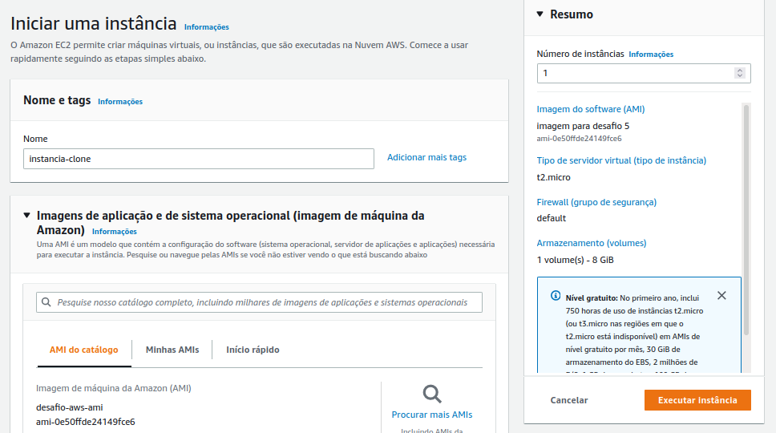

Dessa forma, as duas instâncias ficaram disponíveis a partir do snapshot da primeira EC2:

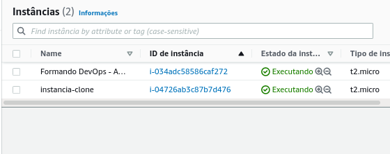

Com as duas instâncias criadas, foi criado o ELB. Entretanto, para criar o ELB, foi preciso primeiramente criar o target group apontando para as duas instâncias anteriormente criadas

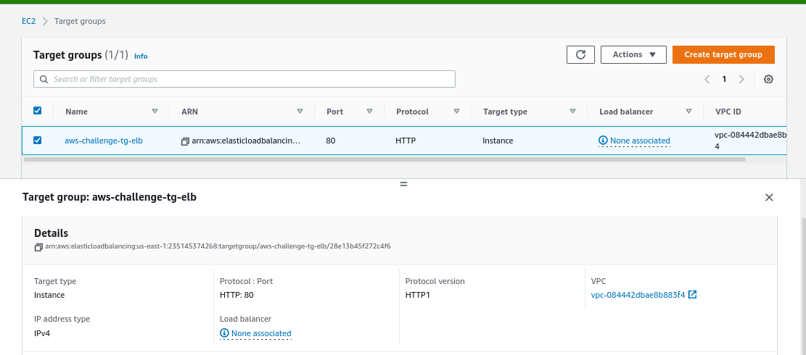

Com o target group criado, foi possível prosseguir com a criação do ELB:

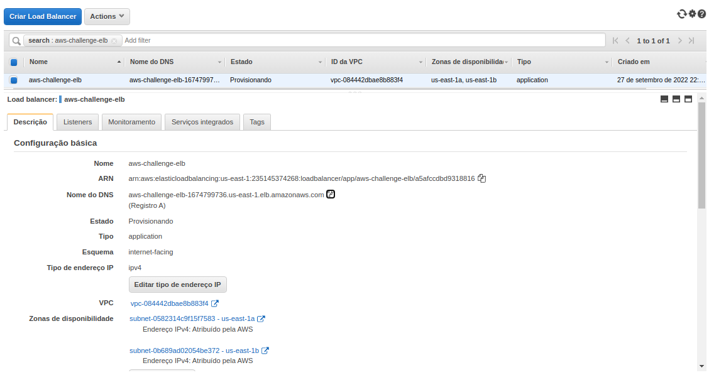

Criado o ELB, alterei o arquivo index.html de cada instância para realizar o teste. OBS: para que o teste obtivesse êxito, precisei alterar o security group para aceitar requisições HTTP de qualquer lugar (0.0.0.0/0)

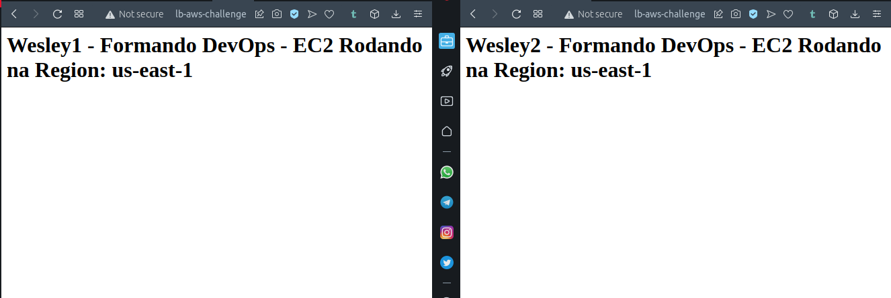

Então desliguei uma das máquinas para realizar o ultimo teste:

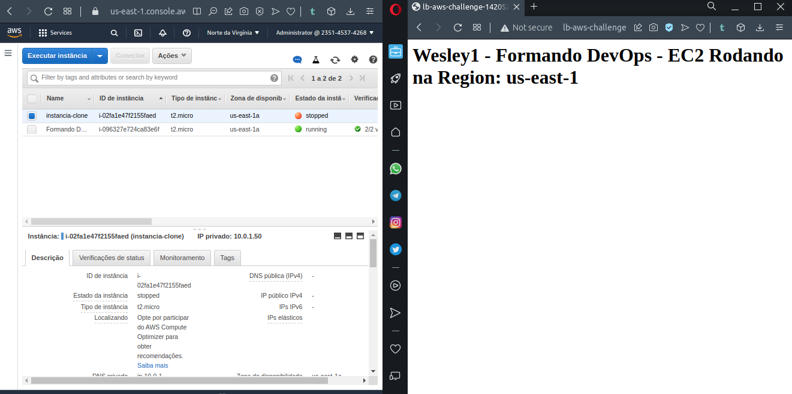

.
 ## 6 - Segurança

 Para este desafio, criei um novo security group para o balanceador, aceitando conexões na porta 80 de qualquer origem:

 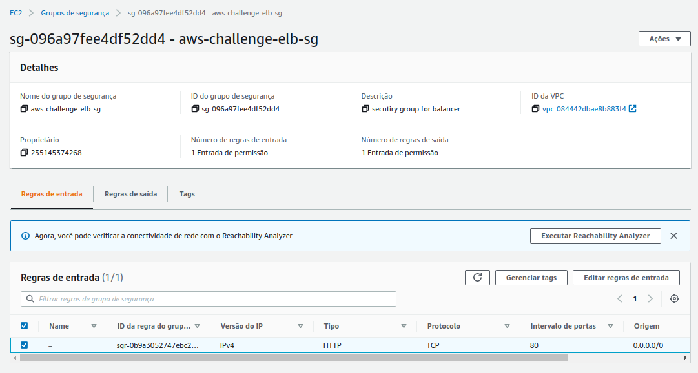

 Então foi alterado o security group do desafio (stack-controle-WebServerSecurityGroup-JWBWE0G0JL1M) para aceitar requisições HTTP somente do secutiry group anterior (aws-challenge-elb-sg):

 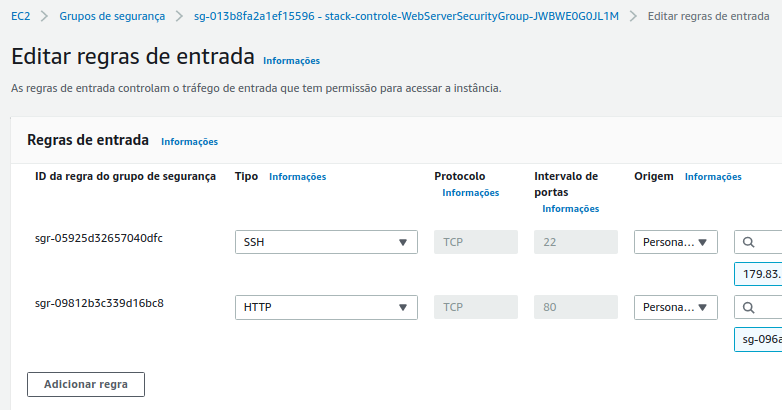

 Também foi realizada a alteração do security group associado ao ELB para o novo security group(aws-challenge-elb-sg):

  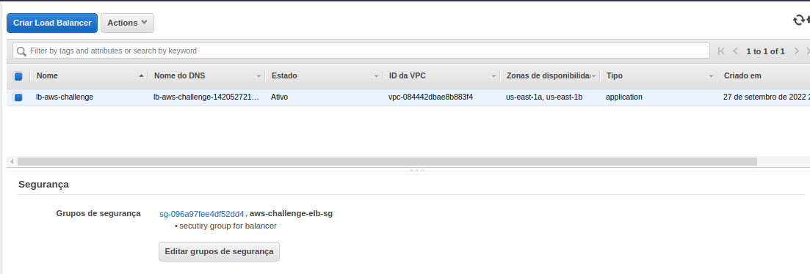

  Dessa forma, o acesso HTTP ao loadbalancer permaneceu intacto:

   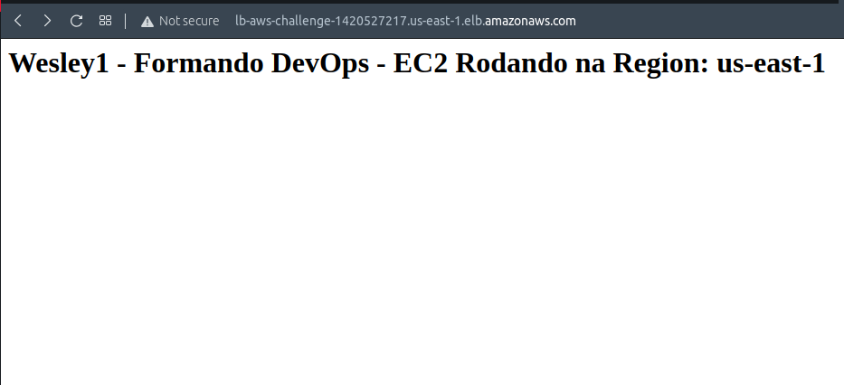

   Mas os acessos via IP/DNS público das instâncias, não:

   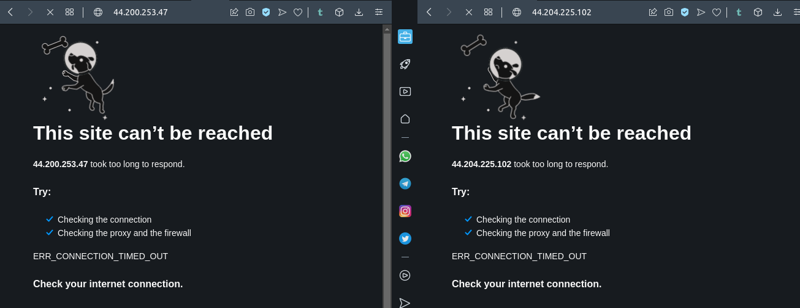

Por fim, destrui toda a stack com o comando do início do desafio:

    export STACK_NAME="stack-controle"
    export STACK_FILE="file://formandodevops-desafio-aws.json"
    aws cloudformation delete-stack --region us-east-1 --stack-name "$STACK_NAME"