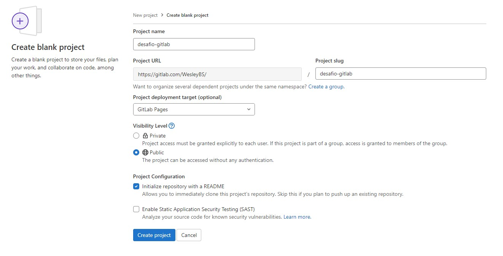

# Desafio GitLab

> 1. Crie uma conta no Gitlab: [Gitlab](https://gitlab.com/users/sign_in)

Realizei com as conta do github

> 2. Crie um repositório público chamado "desafio-gitlab" e clone-o em seu computador.

Após adicionar a chave pública à minha conta, clonei o repositório para minha máquina local:

    ❯ git clone git@gitlab.com:WesleyBS/desafio-gitlab.git

> 3. Adicione os arquivos do desafio ao seu repositório local e faça o primeiro commit.

    ❯ cp -r ../formando-devops/desafio-gitlab/public/ .

> 4. Faça o push do seu repositório local para o repositório remoto.

    ❯ git add .

    ❯ git commit -m "iniciando desafio terraform"   
    [main c3c10f7] iniciando desafio terraform
    2 files changed, 18 insertions(+)
    create mode 100644 public/css/style.css
    create mode 100644 public/index.html

    ❯ git push                                   
    Enter passphrase for key '/home/wesley/.ssh/id_rsa': 
    Enumerating objects: 7, done.
    Counting objects: 100% (7/7), done.
    Delta compression using up to 8 threads
    Compressing objects: 100% (5/5), done.
    Writing objects: 100% (6/6), 656 bytes | 164.00 KiB/s, done.
    Total 6 (delta 0), reused 0 (delta 0)
    To gitlab.com:WesleyBS/desafio-gitlab.git
    7855780..c3c10f7  main -> main

> 5. Mude o texto da página inicial para "Desafio GitLab - Dev".

    ❯ sed -i "s/Gitlab<\/h1>/Gitlab - Dev<\/h1>/g" public/index.html

    ❯ git add public/index.html

    ❯ git commit -m "Desafio Dev"
    [main 3780259] Desafio Dev
     1 file changed, 1 insertion(+), 1 deletion(-)

> 6. Crie uma nova branch chamada "feature" e altere o texto da página inicial para "Desafio GitLab - Feature".

    ❯ git checkout -b feature
    M       public/index.html
    Switched to a new branch 'feature'

    ❯ sed -i "s/Gitlab<\/h1>/Gitlab - Feature<\/h1>/g" public/index.html

    ❯ git add public/index.html

    ❯ git commit -m "Desafio Feature"
    [feature 3794313] Desafio Feature
     1 file changed, 1 insertion(+), 1 deletion(-)

> 7. Crie um pipeline no GitLab CI para fazer o deploy do site estático no GitLab Pages.

git push origin -u feature