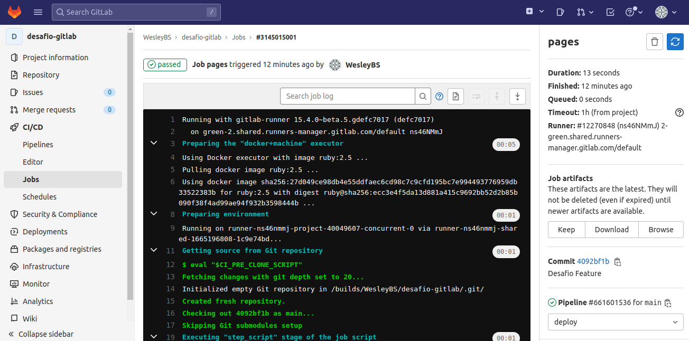
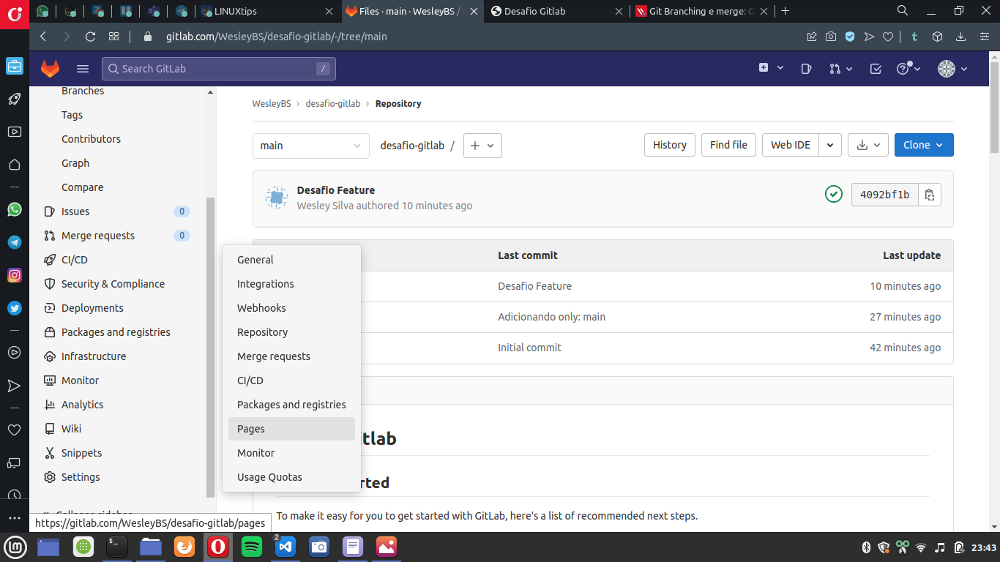
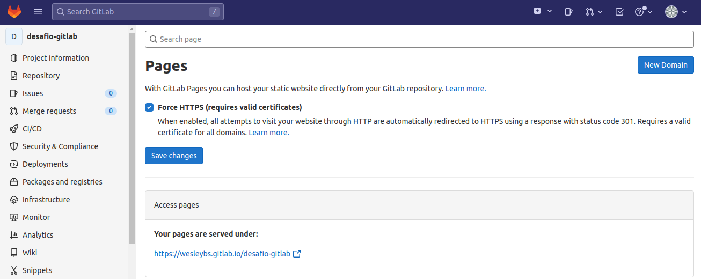
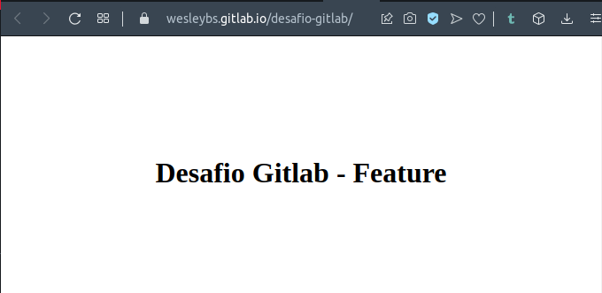

# Desafio GitLab

> 1. Crie uma conta no Gitlab: [Gitlab](https://gitlab.com/users/sign_in)

Realizei com as conta do github

> 2. Crie um repositório público chamado "desafio-gitlab" e clone-o em seu computador.

Após adicionar a chave pública à minha conta, clonei o repositório para minha máquina local:

    ❯ git clone git@gitlab.com:WesleyBS/desafio-gitlab.git

> 3. Adicione os arquivos do desafio ao seu repositório local e faça o primeiro commit.

    ❯ cp -r ../formando-devops/desafio-gitlab/public/ .

> 4. Faça o push do seu repositório local para o repositório remoto.

    ❯ git add .

    ❯ git commit -m "iniciando desafio terraform"   
    [main c3c10f7] iniciando desafio terraform
    2 files changed, 18 insertions(+)
    create mode 100644 public/css/style.css
    create mode 100644 public/index.html

    ❯ git push                                   
    Enter passphrase for key '/home/wesley/.ssh/id_rsa': 
    Enumerating objects: 7, done.
    Counting objects: 100% (7/7), done.
    Delta compression using up to 8 threads
    Compressing objects: 100% (5/5), done.
    Writing objects: 100% (6/6), 656 bytes | 164.00 KiB/s, done.
    Total 6 (delta 0), reused 0 (delta 0)
    To gitlab.com:WesleyBS/desafio-gitlab.git
    7855780..c3c10f7  main -> main

> 5. Mude o texto da página inicial para "Desafio GitLab - Dev".

    ❯ sed -i "s/Gitlab<\/h1>/Gitlab - Dev<\/h1>/g" public/index.html

    ❯ git add public/index.html

    ❯ git commit -m "Desafio Dev"
    [main 3780259] Desafio Dev
     1 file changed, 1 insertion(+), 1 deletion(-)
    
    ❯ git push
    Enter passphrase for key '/home/wesley/.ssh/id_rsa': 
    Enumerating objects: 5, done.
    Counting objects: 100% (5/5), done.
    Delta compression using up to 8 threads
    Compressing objects: 100% (3/3), done.
    Writing objects: 100% (3/3), 362 bytes | 362.00 KiB/s, done.
    Total 3 (delta 1), reused 0 (delta 0)
    To gitlab.com:WesleyBS/desafio-gitlab.git
    3064333..7c00b1f  main -> main

> 6. Crie uma nova branch chamada "feature" e altere o texto da página inicial para "Desafio GitLab - Feature".

    ❯ git checkout -b feature
    M       public/index.html
    Switched to a new branch 'feature'

    ❯ sed -i "s/Gitlab - Dev<\/h1>/Gitlab - Feature<\/h1>/g" public/index.html

    ❯ git add public/index.html

    ❯ git commit -m "Desafio Feature"
    [feature 3794313] Desafio Feature
     1 file changed, 1 insertion(+), 1 deletion(-)

    ❯ git push origin -u feature
    Enter passphrase for key '/home/wesley/.ssh/id_rsa': 
    Enumerating objects: 7, done.
    Counting objects: 100% (7/7), done.
    Delta compression using up to 8 threads
    Compressing objects: 100% (4/4), done.
    Writing objects: 100% (4/4), 380 bytes | 380.00 KiB/s, done.
    Total 4 (delta 2), reused 0 (delta 0)
    remote: 
    remote: To create a merge request for feature, visit:
    remote:   https://gitlab.com/WesleyBS/desafio-gitlab/-/merge_requests/new?merge_request%5Bsource_branch%5D=feature
    remote: 
    To gitlab.com:WesleyBS/desafio-gitlab.git
    * [new branch]      feature -> feature
    Branch 'feature' set up to track remote branch 'feature' from 'origin'.

> 7. Crie um pipeline no GitLab CI para fazer o deploy do site estático no GitLab Pages.

    touch .gitlab-ci.yml

    cat << EOF >> .gitlab-ci.yml
    pages:
    stage: deploy
    script:
    - mkdir .public
    - cp -r * .public
    - mv .public public
    artifacts:
        paths:
        - public
    only:
    - main
    EOF

    ❯ git add .gitlab-ci.yml

    ❯ git commit -m "Subindo página estática com gitlab-ci" -a
    [main 3064333] Subindo página estática com gitlab-ci
    1 file changed, 11 insertions(+)
    create mode 100644 .gitlab-ci.yml
    
    ❯ git push
    Enter passphrase for key '/home/wesley/.ssh/id_rsa': 
    Enumerating objects: 10, done.
    Counting objects: 100% (10/10), done.
    Delta compression using up to 8 threads
    Compressing objects: 100% (8/8), done.
    Writing objects: 100% (9/9), 1.05 KiB | 537.00 KiB/s, done.
    Total 9 (delta 0), reused 0 (delta 0)
    To gitlab.com:WesleyBS/desafio-gitlab.git
    74943d0..3064333  main -> main

> 8. Faça o merge da branch "feature" para a branch "main".

    ❯ git checkout main              
    Switched to branch 'main'
    Your branch is up to date with 'origin/main'.

    ❯ git merge feature
    Updating 506013c..4092bf1
    Fast-forward
    public/index.html | 2 +-
    1 file changed, 1 insertion(+), 1 deletion(-)

    ❯ git push                  
    Enter passphrase for key '/home/sefaz/.ssh/id_rsa': 
    Total 0 (delta 0), reused 0 (delta 0)
    To gitlab.com:WesleyBS/desafio-gitlab.git
    506013c..4092bf1  main -> main

> 9. Encontre o endereço do seu site no GitLab.

> 10. Acesse a página inicial do seu projeto no Gitlab e verifique se o texto foi alterado.

> 11. Adicione no arquivo [RESPOSTAS.md](RESPOSTAS.md) o link para o seu repositório e o log do git com o histórico de commits. Envie também um screenshot da Gitlab Page criada.

https://gitlab.com/WesleyBS/desafio-gitlab

https://wesleybs.gitlab.io/desafio-gitlab/

    ❯ git log --all > gitlog.txt

    ❯ cp gitlog.txt ../formando-devops/desafio-gitlab